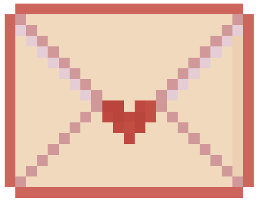
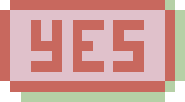
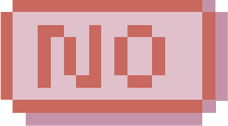

[style.css](https://github.com/user-attachments/files/25091098/style.css)
[settings.json](https://github.com/user-attachments/files/25091097/settings.json)
[script.js](https://github.com/user-attachments/files/25091096/script.js)
[index.html](https://github.com/user-attachments/files/25091111/index.html)
<!doctype html>
<html lang="en">
  <head>
    <meta charset="UTF-8" />
    <link rel="stylesheet" href="style.css" />
    <title>Valentine Letter</title>
    <meta name="viewport" content="width=device-width, initial-scale=1.0" />

    <link rel="preconnect" href="https://fonts.googleapis.com" />
    <link rel="preconnect" href="https://fonts.gstatic.com" crossorigin />
    <link
      href="https://fonts.googleapis.com/css2?family=Aldrich&family=Pixelify+Sans:wght@400..700&display=swap"
      rel="stylesheet"
    />
    <title>Document</title>
  </head>
  <body>
    <!-- Envelope Screen -->
    

      
      
♡ Letter for You ♡

    

    <!-- Letter Screen -->
    

      

        <h1 id="letter-title">這是鉦凱喵的邀請，情人節一起過嗎?</h1>

        

        

          

          

            
          

        

        

          <strong>Valentine Date:</strong> 我就知道，請找一天跟我一起喵喵約會!
        

      

    

    
  </body>
</html>
